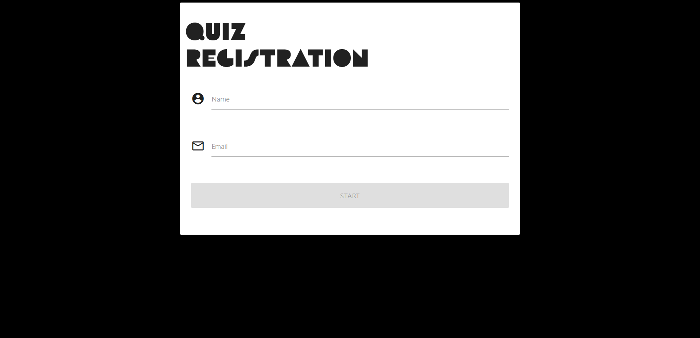
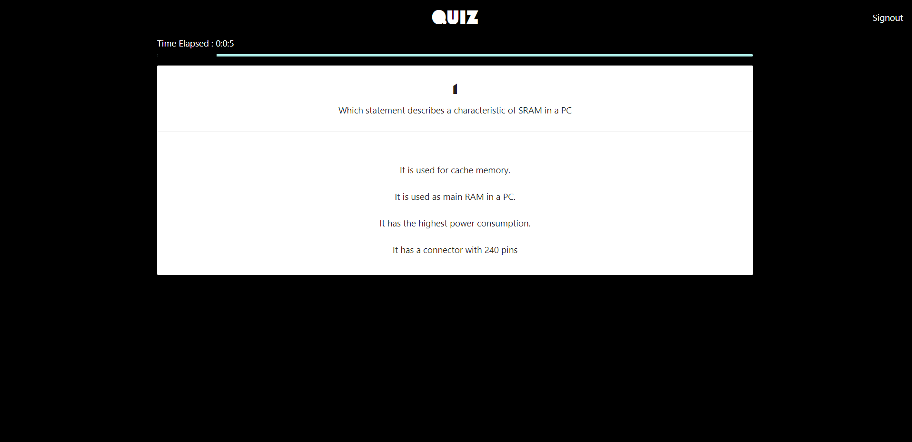
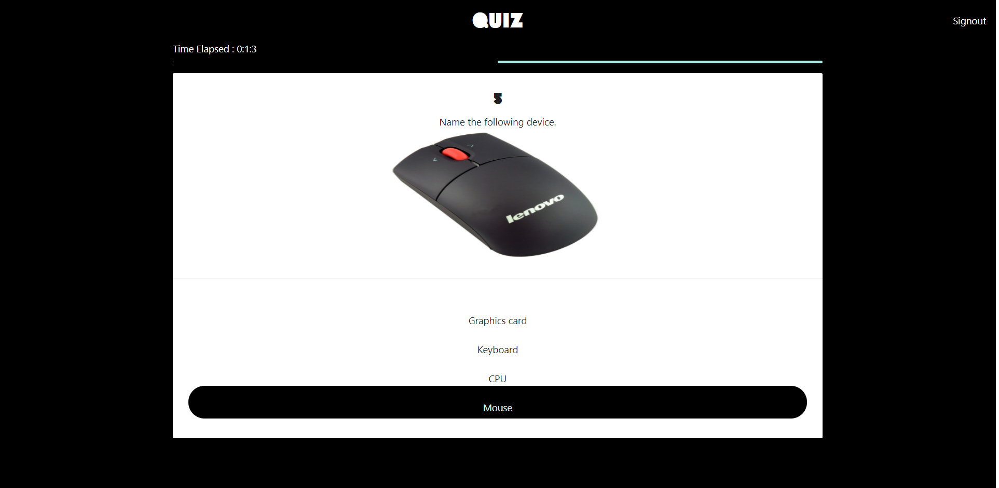
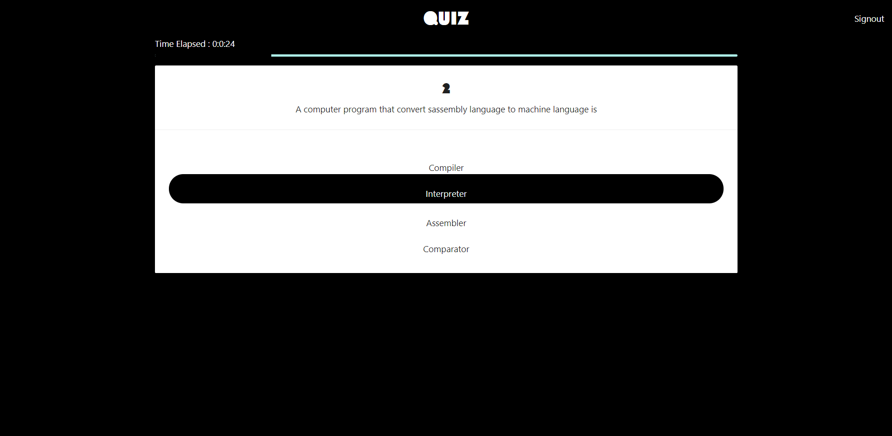
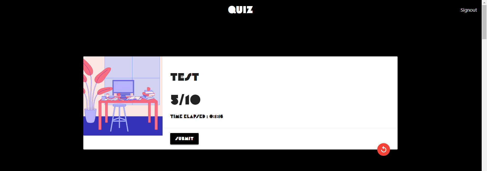
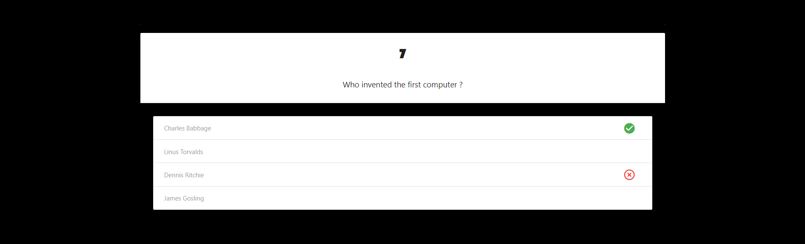
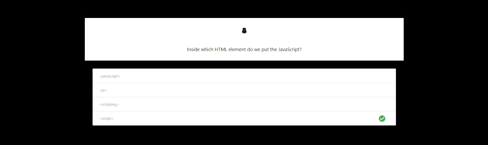

# Quiz Application
> Online quiz application

## Table of contents
* [General info](#general-info)
* [Screenshots](#screenshots)
* [Technologies](#technologies)
* [Setup](#setup)
* [Features](#features)
* [Code Examples](#code-examples)
* [Status](#status)
* [Contact](#contact)

## General info
Inspired by the COVID-19 pandemic and online classes, we decided to create a quiz application, which allows teachers to test their students.

## Screenshots








## Technologies
* Angular - version 9.1.7
* C# 
* SQL 

## Setup
To install this application you need to clone this repository, install the local database from the 'Database backup' folder on your device, run the WebAPI.sln in Visual Studio (you'll find it in the 'WebAPI' folder), at the same time run the Angular part of this application (tutorial on how to run an Angular application, you'll find in the Angular folder). 

## Code Examples
Saving the user in the local database:

front-end:
```typescript
  OnSubmit(name:string,email:string) {
    this.quizService.insertParticipant(name,email).subscribe(
      (data : any) =>{
        localStorage.clear();
        localStorage.setItem('participant',JSON.stringify(data));
        this.route.navigate(['/quiz']);

      }
    );
```
back-end:
```c#
        [HttpPost]
        [Route("api/InsertParticipant")]
        public Participant Insert(Participant model){
            
                try
                {
                    db.Participant.Add(model);
                    db.SaveChanges();
                }
                catch (Exception e)
                {
                    Console.WriteLine(e.Message);
                }
                return model;
            
        }
```
## Features
List of features ready and TODOs for future development
* Registration of a user (user is in the database)
* Time is saved after finishing the test (time is in the database) 
* Results of the test (both the checked answer and the correct answer are shown)

To-do list:
* An administrator panel for teachers (for adding, removing, updating questions and answers)
* Improve the design of sumbit dialog message

## Status
Project is: _no longer continued_. 

## Contact
Created by [@jcieszynska](https://www.github.com/jcieszynska) and [@katkow](https://www.github.com/katkow) - feel free to contact us!
